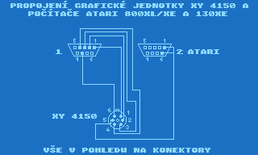
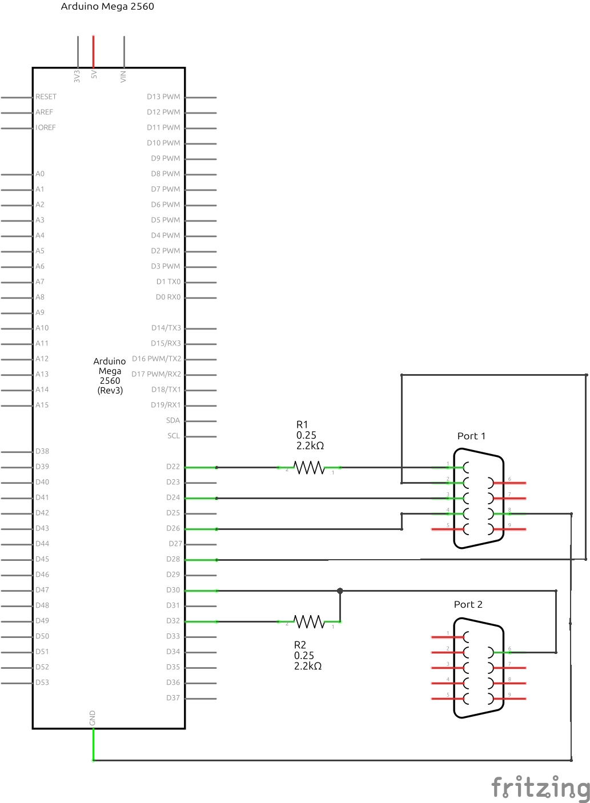
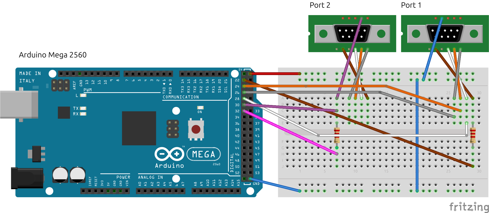
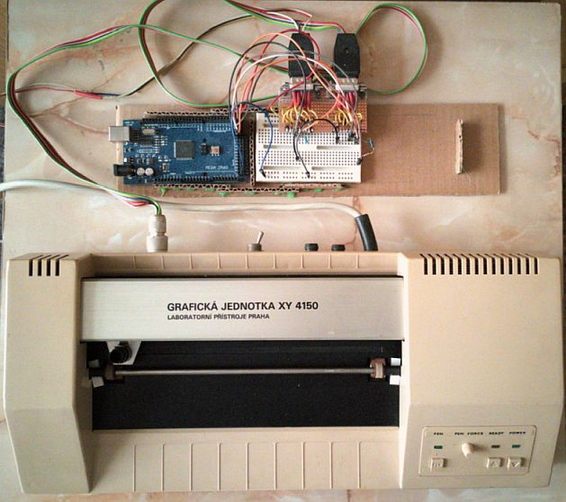
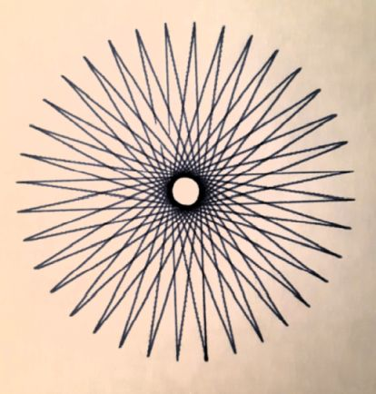
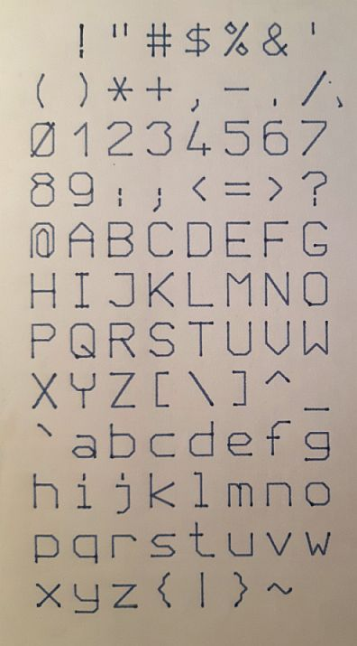
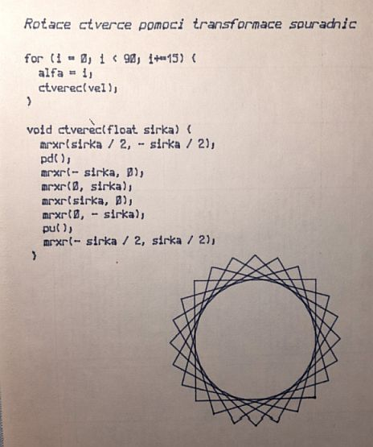

# XY4150 plotter controlled by Arduino

The pen-plotter XY4150 was produced in former Czechoslovakia during late 80th period, as well as Minigraf and other similar devices. It was used mainly with 8 bit computers.

The documentation for plotter can be found in [github.com/oldcomp/xy4150-documentation](https://github.com/oldcompcz/xy4150-documentation "github.com/oldcomp/xy4150-documentation") repository.

There were lots of attepmts to connect plotter to PC, mainly using paralel port. But current PC have no paralel port, so some microcontrollers like Arduino or Raspberry Pi Pico connected to PC through USB and creating serial port can solve the problem. This reporitory contains my previous attempts using Arduino.

## Wiring

"Original" cable for plotter connection to Atari 800 XL has two DB9 connectors for connecting to Atari and special 7 pin connector for connection to plotter.

I used it also for connection of plotter to Arduino, so two female DB9 conectors were necessary to connect to Arduino.

Scheme:

Wiring using breadboard:

Real device:

Arduino - XY4150 direc connection:

| Signal  |  Plotter connector |Arduino Mega 2560| Comment |
| :------------ | :------------ | :------------ |  :------------ | 
| PEN  | 1  | 22 | through resistor 2k2 |
| MOV | 2  | 28 | - |
| X/Y |  3 | 24 | - |
| +/-  |  4 | 26 | - |
| Ready In | 5  | 30 | place resistor 2k2 between 30 and 32 Arduino pins |
| Ready Out | 5  | 32 | - | 
| Ground  | 6  |  GND | - |
| Unused  |  7 | -  | - |

## Software

Enclosed Arduino sketches works but are in early state. Al three sketches contains these  functions:

- Pen Up/Down
- Move relative - draws line 
- Move absolute - draws line
- Turtle graphics
- Characters drawing

Most advanced version is in "XY4150_Coordinate_transformation.ino" sketch containing also transformation of coordinates given by horizontal and vertical chamfer angle and rotation angle, what can be used for example for drawing cursive characters, etc.

Unfortunately, compiled files are larger then 32 kB - capacity of Arduino UNO/NANO, so Arduino Mega has to be used.

## Examples

There are three sketches - examples enclosed:

### Rosette

Short video "rosette.mp4" is in "images" subdirectory.

### ASCII table

Short video "ascii-table.mp4" is in "images" subdirectory.

### Coordinate transformation

## Next targets

- Redesign character drawing to decrease size of compiled files suitable for Arduino Nano/Uno. Perhaps characters could be placed in EEROM, or in SD card, or
- Rewrite programs to MicroPython and run it on Raspberry Pi Pico.
- Create parser for ATARI set of commands for this plotter sent to Arduino through serial port, eventually HPGL or G-Code parser. The last one could be perhaps reached by modification of some Arduino-Grbl library for controlling stepper motors in XY4150 way.
- Connect this device set to Altirra Atari emulator - the device server component of Altirra Extras could catch commands from emulator and send them to Arduino through serial port. 
